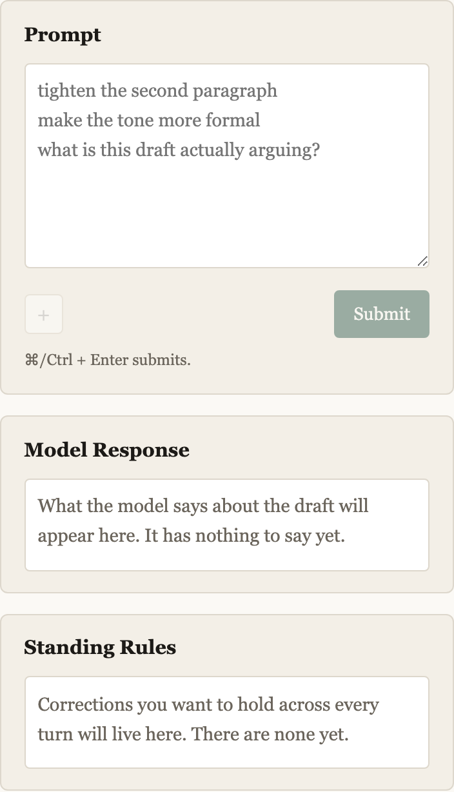

# Chunk 11 fix — the live §2.2 contract, and the rail's structural surfaces

Two independent issues from the first live turn. One was a bug in how the request
enforced the response contract; one was a spec clarification about the right
column. Both are fixed.

**Status: complete, and verified against the live model.** 306 tests pass (was
301; +5). 17 mutations applied and caught across both issues. `node
scripts/smoke-session.js` green at 37 assertions. `npx vite build` clean. The
live evidence is a real 19-turn session exported from the app — §5 below.

**Issue 1 took two attempts. The first fix was wrong and shipped broken**; that is
the most important thing in this report and it is §2.

---

## 1. Issue 2 first, because it is the simple one

### The clarification

§12 said only that the Model Response note wore a white surface. The intent is
broader: **every box in the rail renders its content surface at all times**,
whether or not it has content, with empty-state text inside the surface rather
than in place of it. The rail reads as three parallel boxes at first paint.

Written into §12 (see §6 for the section-number flag). The old narrower sentence
on box 2 is gone, replaced by a pointer to the general rule.

### The rendering

The fix is one CSS change and two component changes:

```css
.box textarea,
.box-surface { width: 100%; font-size: 0.9rem; padding: 0.6rem;
               border: 1px solid var(--line); border-radius: 4px; background: #fff; }
```

**One selector list, not two rules that match.** Chunk 11 had `.note-surface` as
its own rule and a test asserting it carried the same four declarations as
`.box textarea` — which could only ever catch a drift after it happened. Declaring
them together makes "matching anatomy" structural, and there is nothing left to
drift. The test changed accordingly: it now asserts the two selectors are *one
rule*, which is the stronger claim.

`ModelResponse` renders `.box-surface` on all four of its states — never spoken,
in flight, spoke-and-said-nothing, spoke — with only the *content* varying.
`StandingRules` gets the same surface, with its empty sentence inside it; when
step 12 fills that box the editable list replaces the sentence on a surface that
is already there, which is a change of content rather than of anatomy.

Empty-state text keeps `color: var(--muted)` inside the surface, deliberately: it
is the textarea's placeholder, and an empty box is a box with nothing typed in it
yet.

`.note-surface` is gone as a class name; the history view's note wears
`.box-surface` too, so one record looks like itself in both places.

### First paint, in a browser

Not described — measured and photographed. Chromium at 1500×1000, this repo's own
server, a scratch document root:



| box | surface element | x | width | background | border | radius | padding |
|---|---|---|---|---|---|---|---|
| Prompt | `textarea` | 1135 | 315 | `rgb(255,255,255)` | 1px `rgb(221,215,204)` | 4px | 9.6px |
| Model Response | `div.box-surface` | 1135 | 315 | `rgb(255,255,255)` | 1px `rgb(221,215,204)` | 4px | 9.6px |
| Standing Rules | `div.box-surface` | 1135 | 315 | `rgb(255,255,255)` | 1px `rgb(221,215,204)` | 4px | 9.6px |

Identical on every axis. No horizontal overflow; no console or page errors. The
populated state was re-checked too (a real speech-only turn driven through the UI
with a stubbed model) and still renders correctly after the class rename.

---

## 2. Issue 1, and the fix that was wrong

### What you reported

`what do you think of this draft?` → red box in the panel:

> the model returned something that is not the JSON object the response contract
> asks for (Unexpected token '\*', "\*\*What I n"... is not valid JSON).

**Your read was right.** The live model answered in Markdown prose; the chunk-11
tests fed the parser valid fixtures, so the suite stayed green while the real
model did something else; and the request side was not enforcing the contract
hard enough. Nothing in that diagnosis needed correcting.

### Attempt one: assistant prefill. Wrong, and I shipped it.

I added a trailing assistant turn containing `{`, so the reply would be a
continuation of an open brace. The reasoning was sound — a prefill leaves no
position where a preamble can go — and the mechanism is real. It is simply **not
available on this model**:

> `400 invalid_request_error` — *This model does not support assistant message
> prefill. The conversation must end with a user message.*

I had assumed prefill was a general Messages API capability. It was removed across
the 4.6+ family, `claude-sonnet-5` included. I did not check before writing the
code, and the assumption was invisible in a headless test because the stub
`fetch` accepts any request body — **the test asserted the request contained the
assistant turn, which was exactly the thing the API rejects.** A green suite
proved the request was shaped the way I intended and said nothing about whether
that shape was legal.

That is the same failure class as the original bug, one layer up: the first bug
was a fixture standing in for the model's *response*, and this one was a stub
standing in for the API's *acceptance of the request*. Both are only reachable by
a real call.

I asked for the live run before calling it fixed, which is how this surfaced
rather than sitting in the tree. But asking afterwards is not the same as
checking first, and the check was one documentation lookup.

### Attempt two: structured outputs

The documentation names the replacement explicitly:

> Assistant message prefills return a 400 error on … Sonnet 5 … **Use structured
> outputs (`output_config.format`) or system prompt instructions to control
> response format instead.**

So the request now carries:

```js
output_config: { format: { type: 'json_schema', schema: RESPONSE_SCHEMA } }
```

The API constrains generation to the schema, so the reply is valid JSON of the
right shape as a *property of the request* rather than as a hope about the model's
cooperation. Four things I checked in the docs **before** writing it this time,
having just been burned for not doing so:

1. **Supported on `claude-sonnet-5`** — listed among the supported models.
2. **`stop_reason` stays `end_turn`** — so §2.3's guard is untouched and no spec
   change is needed. This is why structured outputs beat forced tool use here:
   `tool_choice` also works on this model, but returns `stop_reason: "tool_use"`,
   which §2.3 refuses. That would have been a §2.3 amendment bought for nothing.
3. **Incompatible with prefilling** — so the two could never have coexisted, and
   the prefill had to come out entirely rather than be layered under.
4. **The schema dialect rejects `minLength`/`maxLength`/numeric bounds** — sending
   one is another 400. There are none in the schema, and a test asserts that by
   scanning the serialized schema for each forbidden keyword.

`RESPONSE_SCHEMA` lives in `src/ai-response.js`, beside `validateAiResponse`, and
`src/anthropic-client.js` imports it. That placement is load-bearing: the shape
the model is *constrained to emit* and the shape the parser *accepts* are now one
object, and `kind`'s enum is generated from `SEGMENT_KINDS`, so adding a kind to
the parser adds it to the request in the same edit. When step 13 swaps `draft` for
`candidates`, both sides change in one file.

The prompt hardening from attempt one stayed, demoted to the second half of
enforcement: `output_config.format` is what makes the reply parseable, and those
words shape what the model chooses to put in the fields. They are also what would
still be standing if the constraint were ever turned off.

`scripts/live-check.js` now runs **both** contract shapes by default — a question
and an edit — because they fail differently and an editing prompt exercises only
one of them. `--legacy` disables the format constraint, keeping your original bug
reproducible on demand: the day a model honours the contract on the instruction
alone is worth being able to detect, and without the flag nobody could.

---

## 3. One judgement call inside Issue 1

**`draft` is now required-but-nullable in the schema.** A speech-only turn emits
`"draft": null` rather than omitting the key.

This is **not a §2.2 shape change** — you scoped that out and I have not touched
it. The parser already accepted both spellings, and chunk 11 has a test asserting
an explicit `null` and an absent field reach the same place. What the schema does
is ask for the version the model cannot produce by *forgetting*: omitting a key is
an accident available to it, and emitting `null` is a decision.

Flagged because it is a change to what the model is asked for, even though nothing
downstream moved. The live session confirms it works: four speech-only turns, all
correct.

---

## 4. What I verified headlessly

306 tests, per file, in isolation. Never a bare total.

| file | pass | fail | change |
|---|---|---|---|
| ai-edit.test.js | 16 | 0 | — |
| ai-response.test.js | 17 | 0 | — |
| **anthropic-client.test.js** | **10** | 0 | **+4** |
| canonicalize.test.js | 60 | 0 | — |
| client-build.test.js | 8 | 0 | — |
| clipboard-paste.test.js | 10 | 0 | — |
| **components.test.js** | **50** | 0 | **+1** |
| draft-session.test.js | 24 | 0 | — |
| history.test.js | 20 | 0 | — |
| namespace.test.js | 21 | 0 | — |
| round-trip-identity.test.js | 18 | 0 | — |
| storage.test.js | 18 | 0 | — |
| tiptap-fixed-point.test.js | 20 | 0 | — |
| turns.test.js | 14 | 0 | — |
| **total** | **306** | **0** | **+5** |

### The five new tests

**Issue 1 (3).**
- *every request constrains the response format to the envelope schema* — asserts
  `output_config` is exactly the schema, **and** that `messages` ends with a user
  turn carrying no assistant message at all. That second half is the 400 written
  down as a test, so the wrong fix cannot come back.
- *the request-side schema IS the parser-side contract, and cannot drift* — same
  object not a copy; `kind` derived from `SEGMENT_KINDS`; `draft` nullable and
  required; `additionalProperties: false` on both objects; no `candidates` yet;
  and the forbidden-keyword scan from point 4 above.
- *the format constraint can be turned off for diagnostics* — the `--legacy` path.

**Issue 2 (2).**
- *all three boxes render a white content surface at first paint* — every box has
  a surface before it has content, and each empty-state sentence is *inside* its
  surface (asserted by `contains`, not by both merely existing).
- *the surface and the Prompt textarea are ONE rule, not two that match* —
  replaces chunk 11's declaration-by-declaration comparison, plus the muted
  empty-state colour and the `min-height` that keeps an empty surface from
  reading as a sliver.

### Mutation checks — 17, all caught

Ten for the fix as first written, seven for the rewrite. Each applied alone and
reverted from a byte-compared backup.

| # | mutation | exact message |
|---|---|---|
| K | the request drops `output_config` entirely | `AssertionError: Expected values to be strictly deep-equal + undefined` |
| L | an assistant turn comes back (the 400 this model returns) | `AssertionError: 2 !== 1` (messages length) |
| M | the client restates the schema instead of importing it | `AssertionError: the same object, not a copy` |
| N | `draft` stops being required, so the model may forget it | `AssertionError: strictly deep-equal` on `required` |
| O | the `kind` enum is hardcoded and can drift from the parser | `AssertionError: strictly deep-equal` on the enum |
| P | `additionalProperties` dropped from the envelope | `AssertionError: + undefined` |
| Q | a `maxLength` sneaks into the schema | `AssertionError: maxLength is not supported by the schema dialect` |
| F | Model Response renders its empty state without a surface | `AssertionError: Model Response must have a content surface before it has content` |
| G | Standing Rules goes back to a bare caption | `AssertionError: Standing Rules must have a content surface before it has content` |
| H | the surface is split back into its own rule, free to drift | `AssertionError: the textarea and the surface must be declared together` |
| I | the empty state stops being muted inside the surface | `AssertionError: did not match /color: var\(--muted\)/` |
| J | an empty surface collapses to a sliver | `AssertionError: an empty surface is still a surface, not a line` |

(The five from the superseded prefill implementation — A–E — were caught too, but
their tests are gone with the mechanism; recorded here only so the count is
honest about what survives.)

---

## 5. What the live model actually did

The evidence is `draft-transcript.json`, a **19-turn session you exported from the
running app** — better evidence than `live-check` would have produced, because it
is the real path through the UI rather than a script.

Nine AI turns. Two (7, 8) predate speech and carry no `note` — worth saying,
because the history view renders a note-less AI turn without complaint, so the
ledger holds both eras. **Seven are post-fix, and all seven parsed.**

| turn | prompt | shape | snapshot vs. previous | note | segments |
|---|---|---|---|---|---|
| 10 | "what do you think of this draft?" | speech-only | **byte-identical** | 838ch | 1 × `question` |
| 12 | "how about now? …" | speech-only | **byte-identical** | 1099ch | `context`, `question` |
| 13 | "fix the capitalization… tighten…" | revision | changed | 681ch | 2 × `edit` |
| 14 | "do I need the second paragraph at all?" | speech-only | **byte-identical** | 992ch | 1 × `question` |
| 15 | "as writing it's absolute garbage…" | revision | changed | 760ch | 2 × `edit` |
| 16 | "…" (a quoted sentence) | revision | changed | 459ch | 1 × `edit` |
| 18 | "what do you think of my changes?" | speech-only | **byte-identical** | 1261ch | 1 × `question` |

**Both shapes verified live, which is what I said I would not call fixed without.**
Four speech-only turns and three revisions. Every `segments` entry had exactly
`id`/`took`/`kind` with a kind in the enum. No `warnings` and no `stripped` on any
turn — the responses stayed inside the dialect unaided.

Turn 10 is the exact prompt that produced the red box. It is now a §0.9
speech-only turn.

### §0.9 holds byte-for-byte

Every speech-only snapshot is **byte-identical** to the turn before it — not
"similar", identical. That is the positive assertion §0.9 is about: the model
stating it touched nothing.

### F54 (the `humanEditDiff` fix) is confirmed by turn 18

Turn 17 is a hand edit; turn 18 asks "what do you think of my changes?" — §3's
terminal move. Her edits were: cut a sentence, replace `, rephrasings, and
structural` with nothing, `tends to` → `can`, `sooner` → `faster`, and insert a
new clause. The model's note names **each** of them, individually, with reasons.
It could not have done that from the draft alone; it had to receive the word-level
diff. Chunk 11's F54 changed exactly the code path that sends it.

It also caught a defect she had introduced — removing `, rephrasings, and
structural` left `generate alternatives options instantly` — which is §6's "tell
her when you think she is wrong" doing real work on the first session it ran.

### §12's "the panel never restates the draft" holds

Longest verbatim run shared between any note and its snapshot: **10 words**, and
that instance is a phrase being quoted for discussion. Note lengths ran 459–1261
characters against snapshots of 925–1542 — commentary, not restatement. The
`NOTE_MAX_CHARS = 6000` soft guard never fired and, on this evidence, is set about
five times higher than real speech runs.

### §4's export

The file you sent carries `schema_version: 1`, `slug`, `exported_at`, `turns` —
the §4 wrapper, on a real exported file rather than in a test fixture. Notes and
segments travelled with it, which is §9's S13.

---

## 6. Named findings

**F60 — a headless test cannot tell you the API will accept your request.**
`anthropic-client.test.js` injects `fetch`, so the assertion "the request contains
an assistant turn" passed while the real API returned 400 for that exact request.
The suite is right to be hermetic (§5: `npm test` must pass on a fresh clone with
no key), so this is not a thing to fix by making tests hit the network. It is a
thing to fix by **checking the documentation before writing the request, and
running `live-check` before saying a request-shape change works.** Both are now
in the loop. Recorded because it will recur otherwise.

**F61 — the §12 spec change landed in §12, not §14.** You asked twice for "§14's
right-column description". There is no §14: the numbered sections stop at §13
(Open items), and §12 is the only section that describes the right column, so both
edits went there. Flagged rather than silently interpreted, second time of asking.

**F62 — `NOTE_MAX_CHARS` is set ~5× above observed speech.** 6000 was a guess with
no data. Real notes ran 459–1261 characters. Not changed — one session is thin
evidence, and the guard is watching for a pathological case (the draft pasted into
the panel) rather than a typical one, so a loose bound is the right kind of wrong.
Worth revisiting once there are more sessions.

**F63 — the prompt-side hardening is now unmeasured.** With `output_config.format`
doing the enforcing, the emphatic "YOUR ENTIRE REPLY IS ONE JSON OBJECT" block
cannot be observed to matter — a passing turn proves the constraint worked, not
the words. It is kept as the half that survives if the constraint is ever turned
off, and `--legacy` is the only way to measure it. Named so it is not mistaken for
verified.

**No §0 collision, and no §2.2 shape change.** The contract is exactly as chunk 11
left it. §2.3's `stop_reason` guard is untouched, which was a deliberate
constraint on which enforcement mechanism to pick (§2, point 2).

---

## 7. What I did NOT verify

**I did not run `scripts/live-check.js` myself.** The live evidence is your
exported session, which is stronger for the contract question — it is the real UI
path over seven turns — but weaker for two things live-check prints and a
transcript cannot: the exact headers and body on the wire, and whether the model
ID was silently substituted. The script is updated and syntax-checked; it has not
executed against a real key.

**I did not verify `--legacy` reproduces the original bug.** It should — it sends
the pre-fix request shape — but that is an inference from one changed field, not
an observation. One run would settle it.

**I did not verify a response that violates the schema.** Structured outputs makes
it hard to produce one deliberately, so §2.3's malformed guard is now exercised
only by fixtures. That guard is the one that saved the draft when this bug fired,
so it should not rot; it stays covered headlessly and unmeasured live.

**I did not verify a long note.** The longest real note was 1261 characters. The
`NOTE_MAX_CHARS` warning path, and how a 6000-character note behaves in a 22rem
rail, remain fixture-only.

**I did not verify the `max_tokens` interaction with structured outputs.** The
docs note that `stop_reason: "max_tokens"` can truncate structured output mid-JSON.
§2.3's stop_reason guard catches it as a failed turn — correct behaviour — but no
live turn came close to the ceiling, so the budget arithmetic is still unmeasured
against a long draft plus a long note.

**I did not re-verify the §12 breakpoint below 60rem** with the new surfaces. The
rail's contents changed shape again; the stacked layout is untested.

---

## 8. Stopping here

Both issues are closed. Step 12 (context files and human-written standing rules)
is next and I have not started it. Its inheritance is unchanged from chunk 11,
plus one addition: `.box-surface` is the anatomy the Standing Rules box already
wears, so step 12 fills a surface rather than adding one.
