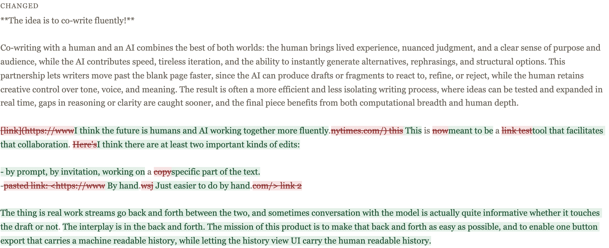
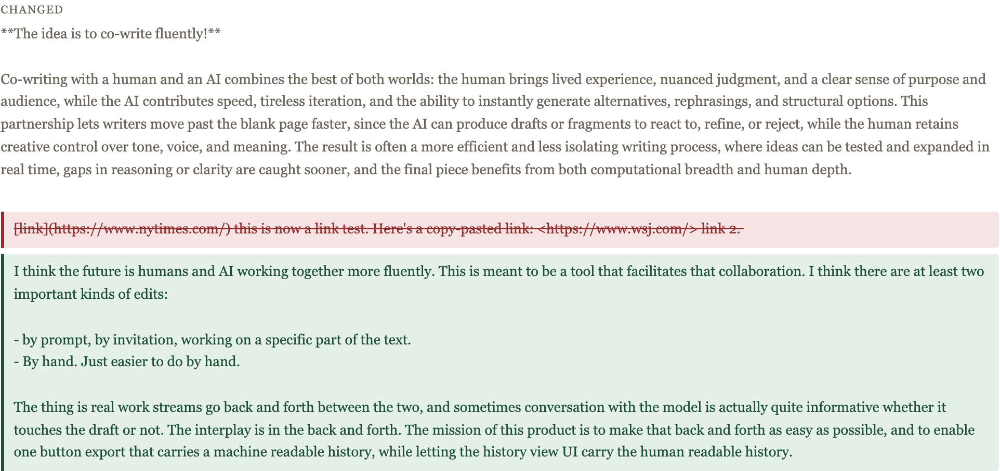
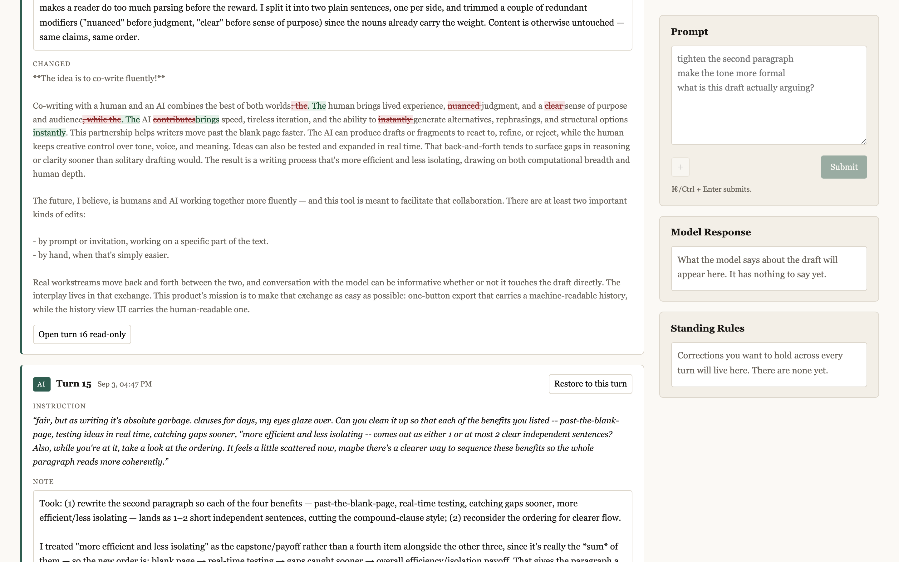

# Chunk 11a — three fixes from live use, plus bookkeeping

Three problems the first live session exposed, raised as F64/F65/F66 in §13 and
resolved. Nothing in the provenance model, the turn records, or snapshot
behaviour was touched; everything committed in 0adf03d stands as it was.

**Status: complete, all four verified.** 319 tests pass (was 306; +13). 10
mutations applied and caught. `node scripts/smoke-session.js` green at 37
assertions. `npx vite build` clean.

The diff fix and the rail fix are verified in a real browser against the actual
live ledger, with before/after screenshots below. **The §2.2 amendment is verified
against the live model**: three consecutive runs, every speech-only turn returning
`"draft": null`, every revision turn returning a full draft string, all parsing
(§4).

---

## 1. Bookkeeping: F64, F65, F66

The three deferred items from 0adf03d's commit message are now numbered in §13,
each with the evidence that raised it, and each marked resolved with a pointer to
the section that resolves it. Numbering continues from F63 (chunk-11-fix), so
nothing collides with a number already used in `reports/`.

---

## 2. F64 — the confetti diff

### What was wrong

A word-level diff is right for edits and wrong for replacements. When a human turn
deletes a passage and writes new text that happens to share incidental words, the
diff stitches strikethrough fragments through the new prose. Live turn 10 → 11 is
the case: the change pattern was

    = - + = - + = - + = - + = - + = - + = - + = - + = - + = +

— **ten alternating delete/add pairs**, joined by equalities that were `". "`,
`" a "`, `" is "` and `"-"`. Every mark was correct. The result was unreadable.

### The rule

§4 now says: when the changed fraction of a contiguous region exceeds a threshold,
that region renders as a deletion block followed by an addition block rather than
interleaved word-level marks.

`groupDiffRegions` in `src/diff.js` decides; `History.js` renders the decision.
Three conditions must all hold before a region blocks, and each one exists to stop
a specific wrong answer:

| condition | constant | why it exists |
|---|---|---|
| the region has **both** an insertion and a deletion | — | a pure insertion has no interleaving to fix; blocking it would only add a paragraph break |
| changed fraction ≥ threshold | `BLOCK_THRESHOLD = 0.5` | below half, the unchanged text is the majority and is what gives the marks their context |
| changed characters ≥ floor | `BLOCK_MIN_CHARS = 120` | a two-word swap is 100% changed inside its own tiny region; blocking it would wreck the case word diffs handle best |
| region boundary | `ANCHOR_MIN_CHARS = 24` | `". "` between two rewritten sentences is coincidence, not shared text; without this every diff is one region and untouched paragraphs get swept in |

**Naming the threshold, as asked: 0.5.** Half is the natural place rather than a
tuned one — it is the point where the changed text stops being an edit *to* a
passage and starts being the passage. The live case sits at 0.97, so it is not
close to the boundary, and I would rather the constant be explicable than fitted.
The floor and the anchor length are the two that actually needed choosing:
`BLOCK_MIN_CHARS = 120` is roughly a long sentence, and `ANCHOR_MIN_CHARS = 24` is
roughly a short clause. All three are parameters on `groupDiffRegions`, and the
test drives each one independently to prove it is load-bearing.

### Measured against every real transition

I ran the grouping across all 18 consecutive snapshot pairs in the live ledger.
Six regions blocked; every one is a genuine wholesale replacement. Every small
edit stayed inline. The two cases most worth checking:

- **Turn 16 → 17** (your five hand edits): `tends to` → `can` and `sooner` →
  `faster` both stayed **inline**. The deleted sentence stayed inline too, as a
  pure deletion. Only the real replacement — `, rephrasings, and structural
  options instantly.` → ` options instantly. It also brings the ability to
  workshop…` — blocked. That is the exact discrimination the floor is for.
- **Turn 10 → 11**: one anchor region (the untouched opening) and one replacement.

### Before and after, in the browser

The real ledger replayed into a scratch namespace and rendered by the real app.
Same turn, same data, threshold flipped:

**Before —** 19 del/ins marks, deleted URL fragments threaded through the new prose:



**After —** 1 replacement block, 2 marks:



### It is a rendering change, not a data change

A blocked region's two sides carry every word of the before-text and the
after-text; nothing is elided or summarized. There is a test that reconstructs
both inputs from the regions for five different shapes of change.

One caveat, found while writing that test and worth stating precisely: the
reconstruction is exact **up to whitespace**. `diffWords` treats whitespace runs
as ignorable, so an equal chunk may carry the spacing of either side — in the live
case, one trailing newline renders as a space. **This is inherited, not
introduced**: concatenating the non-added parts of a plain word diff already fails
to rebuild the input byte-for-byte, identically, on the old inline path. There is
a test pinning that it is `diffWords`' behaviour and not the grouping's, which
will fail if a future `diff` upgrade makes the inline path exact.

**`formatDiffForPrompt` is deliberately untouched.** The model-facing diff (§2.1)
still emits one `ADDED`/`REMOVED` line per fragment, so for a replacement it sends
the model the same confetti in list form. Two reasons to leave it: you scoped this
item to §4's rendering, and the live evidence says the model copes — turn 18's note
named all five of your hand edits correctly from exactly that fragmented input.
Named here so it is a decision rather than an oversight.

---

## 3. F65 — the rail at scroll depth

### What was wrong

`position: sticky` only holds an element inside its own containing block, which
for a grid item is its **grid area**. The rail sat in row 1 of column 2; the
history sits in row 2 of column 1. So the rail's containing block ended where the
editor ended, and scrolling into the history scrolled the whole panel away. §4
makes the history the only scrollback, so reading it at length is normal — and the
reason to read it is to then act, which meant a round trip back up the page every
time.

### The fix

Two rules, both needed:

```css
.rail {
  position: sticky;  top: 1.5rem;
  grid-column: 2;  grid-row: 1 / -1;          /* containing block = whole workspace */
  max-height: calc(100vh - 3rem);             /* a sticky element taller than the  */
  overflow-y: auto;                           /* viewport pins its top; Submit was */
  scrollbar-gutter: stable;                   /* otherwise unreachable at any depth */
}
```

The second rule matters as much as the first: spanning rows alone would pin the
rail's *top* and leave Submit below the fold at every scroll position. Capping to
the viewport and letting the rail scroll internally is what makes the whole column
reachable rather than its first screenful.

Below the 60rem breakpoint all of it is unset — there the rail is a band under the
draft, not a column beside it, and sticky would pin a full-width block over the
editor.

**This is not the chunk-08 bug in reverse.** That was the *history* spanning
`1 / -1` and sliding under the sticky rail, because both were in the same columns.
These two are pinned to different columns, so spanning rows cannot make them
overlap. Measured: rail left edge 1056, history right edge 1032.

### Verified in the browser at real length

The live 19-turn ledger, page height **10,836px**, viewport 900px:

| scrollY | Prompt top | Prompt in view | Model Response in view | Submit visible |
|---|---|---|---|---|
| 0 | 175 | yes | yes | yes |
| 1500 | 24 | yes | yes | yes |
| 3000 | 24 | yes | yes | yes |
| 6000 | 24 | yes | yes | yes |
| 9936 (bottom) | 24 | yes | yes | yes |



jsdom has no layout, so the two rules are additionally pinned against the
stylesheet text — including that the rail has not become `position: fixed` or
grown a `z-index`, which is how a sticky panel turns into the overlay §12 forbids.

---

## 4. F66 — §2.2 amended, `draft` required-but-nullable

### The change

`draft` was already required-and-nullable in `RESPONSE_SCHEMA` as of
chunk-11-fix — that part is unchanged and is cited rather than rewritten. What was
missing was everything around it:

1. **§2.2's text** now states the rule, what `null` means, and *why* it is
   required-but-nullable rather than optional: the model must **declare** no-edit
   and cannot arrive at one by omitting a key. An absent field is a decision it
   can make by forgetting. The section also notes the property must survive the
   swap to `candidates` — an empty array is the same declaration.
2. **The request-side instruction** was the actual gap. `draft: null` was the last
   line of the contract block and read as a footnote, so the model treated
   reproducing the draft as the safe default. It is now the *shown default* in the
   example object, followed by a mechanical test ("if you are not making a
   specific change to specific words, `draft` is null"), an enumeration of the
   cases that are null, and an explicit statement that reproducing the draft is
   the one thing never to do — with the reason, which is that she waits for it.
3. **The parser comment** now says absent-`draft` is deliberate leniency rather
   than a second spelling of the contract: the schema is what asks for the field,
   and a parser that also refused the absent case would turn a request-side
   regression into a lost turn, throwing away the model's speech along with it.

### Verified against the live model

Both halves of your acceptance criterion, `claude-sonnet-5`, three consecutive
runs of `scripts/live-check.js` (six calls):

| turn | prompt | `draft` field | parsed | committed as |
|---|---|---|---|---|
| speech-only | "what do you think of this draft?" | **`null`** | yes | §0.9 unchanged snapshot |
| edit | "Make the second sentence a little more direct." | string, 150–156 chars | yes | a revision |

`draft: null` on every one of the three speech-only turns — the instruction is
landing, not landing intermittently. No warnings fired, nothing was stripped,
`stop_reason` was `end_turn` throughout, and headroom used was 6–13% of
`max_tokens`.

Worth recording because it is the thing `result.changed` cannot tell you: the
speech-only turns returned `null`, they did not return a reproduced draft that
happened to be identical. The two are indistinguishable in the ledger and cost
very different amounts, which is exactly why the raw envelope is read.

---

## 5. Instrumentation

`scripts/live-check.js` now prints, per turn:

- input tokens, with cache read/write broken out when present
- **output tokens**, with tokens/second and the percentage of `max_tokens` used
- whether the raw envelope's `draft` was literally `null` or a string of N chars

That last one matters because `result.changed` **cannot** tell you: a reproduced
draft and a `null` draft both leave the snapshot unchanged, so the ledger looks
identical either way.

### The first version of the summary metric was wrong, and the live run proved it

I first had it report the speech-only turn's output tokens as a percentage of the
revision's, with the warning "if that is near 100%, the model is reproducing the
draft". The first live run returned **158%** — which reads like a failure and is
not one. The speech-only turn wrote a longer *note* (663 chars of critique) than
the edit turn wrote note-plus-draft (137 + 150).

The ratio is dominated by note length, and note length is the one thing in the
comparison that has nothing to do with F66. It would also have been *most*
misleading on exactly the draft this script uses: two sentences, so regenerating
the whole thing costs ~43 tokens — noise.

Replaced with the measurement that answers the question:

```
  turn                 "draft"      out tok   note ch     ms
  speech-only (§0.9)   null             443       663   7278
  edit                 150 ch           280       137   3423

  PASSING: every speech-only turn returned "draft": null — zero output tokens
  spent on draft text (§2.2, F66).

  Cost avoided scales with the draft, not with this test. Here the draft is
  151 chars, so regenerating it would have cost about 43 tokens. At 1,500
  chars that is ~429; at 6,000, ~1714 — on every question asked.
```

Pass/fail is now the yes/no the criterion actually names — did any output token go
on draft text — and the saving is reported as a scale, because it is a property of
the draft rather than of this script's fixture. It fails loudly and specifically if
a speech-only turn ever comes back with a draft string.

**To run it**, from the project root with the key in the environment or in `.env`:

```
node scripts/live-check.js            # both shapes: a question, then an edit
node scripts/live-check.js --legacy   # without the format constraint, for comparison
```

Two real calls per run.

## 6. What I verified headlessly

| file | pass | fail | change |
|---|---|---|---|
| ai-edit.test.js | 16 | 0 | — |
| ai-response.test.js | 17 | 0 | — |
| anthropic-client.test.js | 10 | 0 | — |
| canonicalize.test.js | 60 | 0 | — |
| client-build.test.js | 8 | 0 | — |
| clipboard-paste.test.js | 10 | 0 | — |
| **components.test.js** | **51** | 0 | **+1** |
| **diff-regions.test.js** | **7** | 0 | **new** |
| draft-session.test.js | 24 | 0 | — |
| **history.test.js** | **25** | 0 | **+5** |
| namespace.test.js | 21 | 0 | — |
| round-trip-identity.test.js | 18 | 0 | — |
| storage.test.js | 18 | 0 | — |
| tiptap-fixed-point.test.js | 20 | 0 | — |
| turns.test.js | 14 | 0 | — |
| **total** | **319** | **0** | **+13** |

**`test/diff-regions.test.js` is new** — the grouping decision is a data question
and should be answerable without a DOM, so the thresholds are tested at the diff
layer and the markup is tested in `history.test.js`.

### Mutation checks — 10, all caught

| # | mutation | test that caught it |
|---|---|---|
| R | blocking turned off entirely | the live confetti case (+4 others) |
| S | a pure insertion is blocked too | a pure insertion is not blocked |
| T | the size floor removed | a small edit still renders inline |
| U | anchors stop ending regions | the live confetti case — `1 !== 2` regions |
| V | a replacement drops the unchanged text | a blocked region loses no content |
| W | the addition block renders before the deletion | deletion block comes first |
| X | the rail loses `grid-row: 1 / -1` (F65 restored) | the rail is reachable at any scroll depth |
| Y | the rail loses its viewport cap | same test, `max-height` assertion |
| Z | the null instruction demoted to a footnote | §6 payload test |
| AA | `draft` stops being required in the schema | the schema IS the parser-side contract |

---

## 7. Named findings

**F67 — `formatDiffForPrompt` still sends the model confetti.** §2.1's diff is
unchanged, so a wholesale replacement reaches the model as ~19 fragmented
ADDED/REMOVED lines. Out of scope as you drew it, and the live evidence says the
model copes. Worth revisiting if a turn is ever observed misreading a replacement
as a set of scattered edits.

**F68 — the whitespace caveat in diff reconstruction.** Described in §2. Inherited
from `diffWords`, present identically on the old path, visible now only because
the block rendering made it worth asserting. No content is affected; a deleted
passage may render with a line break where the source had a space.

**F70 — the first summary metric was a ratio, and ratios were the wrong shape.**
Described in §5. Recorded rather than quietly fixed because it is the second time
in three chunks that an instrument I wrote would have reported a passing system as
failing: the measurement has to be the criterion, not a proxy that correlates with
it on the data I happened to imagine.

**F69 — `BLOCK_THRESHOLD` is explicable, not fitted.** 0.5 is chosen for being the
natural midpoint rather than tuned against data. The live corpus does not
discriminate between plausible values — the case that matters sits at 0.97 and the
cases that must stay inline sit far below any threshold — so a fitted number would
be false precision on one session. The floor and anchor length are the two doing
real work.

**No §0 collision.** Nothing here needed a locked decision to be different. The
provenance model, turn records, and snapshot behaviour are untouched, as scoped:
`src/turns.js` and `src/storage.js` are unchanged in this chunk.

---

## 8. What I did NOT verify

**Whether the strengthened instruction is what changed the behaviour.** Three
speech-only turns returned `null` and none reproduced the draft, so F66's symptom
is gone. But the schema permitted `null` before this chunk too, and I did not run
the *old* instruction against the live model for comparison — so "the instruction
fixed it" is an inference, not a measurement. The alternative explanation is that
this script's two-sentence draft is cheap enough to reproduce that the model would
have returned `null` anyway, and the original problem only shows up on a real
draft. **The honest test is your next real session**, on a 1,500-character draft
where regeneration costs something.

**Whether the saving holds on a long draft.** The estimates in the summary table
(~429 tokens at 1,500 chars) are arithmetic from character counts, not measured.

**The `--legacy` path.** Still never executed against a real key.

**The rail below the 60rem breakpoint.** The stacked layout's unset rules are
pinned in the stylesheet but not rendered — the browser check ran at 1440px only.

**Long-note behaviour in the capped rail.** The rail now scrolls internally above
`100vh`. No live note has come close: the longest was 1261 characters. A note long
enough to make the rail scroll is untested.

**Diff performance on a large draft.** `groupDiffRegions` is O(parts) over an
already-computed diff, so it adds nothing meaningful, but the whole history view
still re-diffs every turn on every render and no draft in evidence is large enough
for that to matter yet.

---

## 9. Stopping here

Chunk 11a is done bar the live run. Step 12 (context files and human-written
standing rules) is next and I have not started it. One thing it inherits that did
not exist before: §2.2's null rule is the shape `candidates` must preserve — an
empty array has to mean the same declaration `null` does now, or F66 comes back
the moment staging lands.
