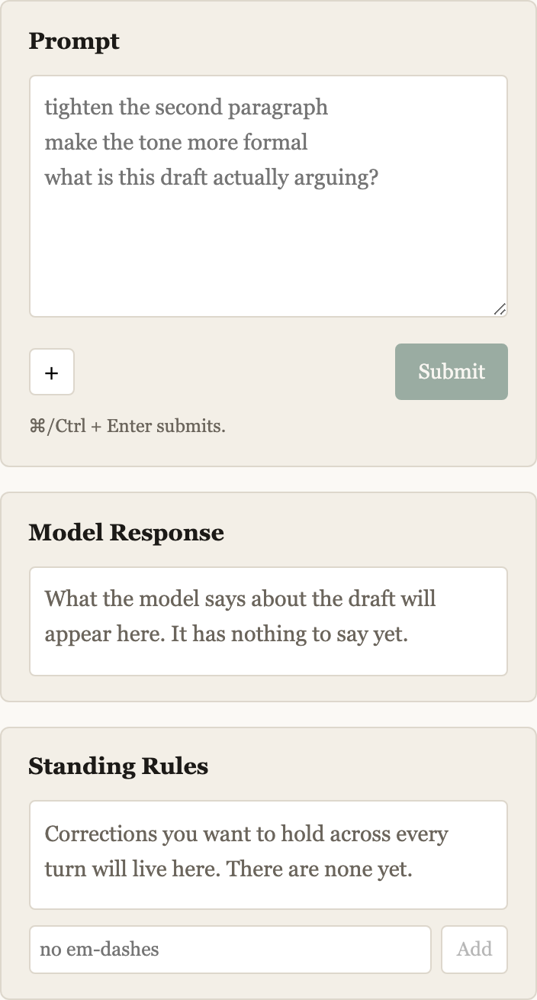
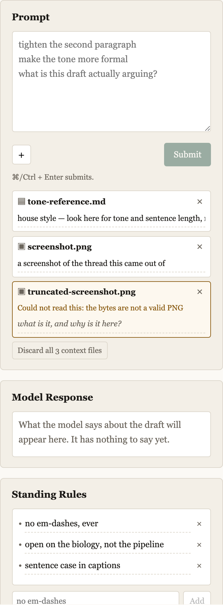

# Chunk 12 — context files and human-written standing rules

Build order step 12. §8 (C1–C6, locked behavior §0.10) and §10's human-written
half (locked behavior §0.11), plus the §2.1 payload assembly that makes both
reach the model. F48 resolves here.

**Status: complete, live-verified.** 382 tests pass (was 352; +30). `node
scripts/smoke-session.js` green at 38 assertions. `npx vite build` clean.
`node scripts/secret-scan.js` clean. Live spend $0.0402 of the $1.00 window
across 6 calls.

All three required live turns pass, and one of them found a real imprecision
worth reporting rather than smoothing over (§5.2).

**Field-verified the same night on a real task** (§5.5), which closes the half of
F77 the synthetic fixture could not reach: the model read exact numbers off real
screenshots and caught a duplicate upload from the images themselves.

---

## 1. The §0.5 amendment, as ratified

Written into §0.5, replacing the sentence that put context inside the document
JSON:

> **Context file CONTENT is stored as sibling files** under
> `documents/{token}/files/{id}`, resolved through the same single
> namespace-resolution function. The document JSON holds context **metadata
> only** — id, filename, description, type, extraction status — and remains the
> source of truth for what exists. A file on disk with no metadata entry is not
> context; deleting context deletes the file. No endpoint lists or reads across
> namespaces, unchanged. Export transcript carries context metadata, never file
> bytes (§4).

**Through the same one function**, not a second token→path mapping.
`resolveNamespaceFiles` in `src/namespace.js` calls `resolveNamespace` and
derives `filesDir` from its answer, so §0.5's "replacing capability tokens with
real accounts must be a change to that function and nothing else" still holds:
the files directory changes only because the namespace did.

**The document is the source of truth, and the direction matters.** A file with
no metadata entry is invisible to `listContext`, so a half-finished write leaves
an orphan on disk rather than a phantom entry in the document. Deletion goes
metadata-first: if the unlink fails, the file is already not context.

Measured: a document with a PNG attached serializes to under 2KB, and the test
asserts no base64 run over 200 characters appears in the document JSON at all.

---

## 2. What I built

### Server

| file | what |
|---|---|
| `src/context-store.js` (new) | §8 C1–C5. Attach, describe, discard one, discard all, read content. Pure over documents; **nothing in it can commit a turn.** |
| `src/rules-store.js` (new) | §10, §0.11. `resolveRules` is the one door; `source` is a field. |
| `src/namespace.js` | `resolveNamespaceFiles`, derived from the one function. |
| `src/anthropic-client.js` | §2.1 items 4–5. The user turn is now **content blocks**, so an attached image is a real `image` block. |
| `src/server.js` | Seven CRUD routes, none of which can initiate a turn. |
| `src/ai-edit.js` | Loads context content at turn time — and only there. |
| `src/turns.js` | §3's `context_ref` / `rules_ref`, by id. |

**The payload order is an argument, not an accident**: context, then rules, then
the hand-edit diff, then her message, then the draft, then the format reminder.
Context and rules are setup — identical every turn, and where a cache prefix
would want them — while the message and draft are what changed. The diff sits
before the message because §2.1 item 2 is the point of the app and the message is
often *about* it.

**Each context file is introduced description-first.** §8 C2 is the reason: the
same document can be a tone reference, source material, or a scaffold, and which
one it is cannot be inferred from the file — so the model is told what it is
looking at before it looks.

### Client

`PromptBox` gains the file input behind the `+` (F48), chips carrying editable
descriptions, and §8 C5's wholesale-discard control. `StandingRules` becomes an
editable bullet list with an add form. `App` reads the file with `FileReader` and
sends base64; `draft-session` gains `context`, `rules`, and — deliberately — a
**separate `busyContext` flag**.

That separation is §0.10 in miniature. `pending` gates turn-making work and the
§0.2 editor lock hangs off it. Routing a file upload through it would make the
editor read-only while a screenshot uploads, which is exactly the conflation of
"she gave me a file" with "she asked for an edit" that §0.10 forbids. The editor
stays live throughout, and there is a test.

### The §5 third fixture

`test/fixtures/context/` — `tone-reference.md` (house-style notes, the shape §8
C2 has in mind) and `screenshot.png`, generated by
`scripts/make-context-fixture.js` so a shared artifact is reproducible.

**The first version of that PNG had a bug and I rebuilt it.** It wrote one byte
per loop step across `width * 3` bytes, so the checkerboard's block boundary fell
every 8 *bytes* rather than every 8 pixels; blocks straddled pixel boundaries and
the intended grey checkerboard came out with red, blue, cyan and yellow fringes —
six colours where two were intended. The replacement writes a whole pixel at a
time and is three horizontal bands, red/green/blue, verified as exactly three
distinct colours. Content that is easy to state in words is what makes the
fixture usable as a live check of §8 C3: a fixture nobody can describe cannot
test whether the model described it.

---

## 3. §0.10, asserted rather than assumed

This is the locked decision the chunk most easily breaks, so it is checked in
four places:

1. **The stores** cannot reach `commitHumanTurn` — no import, by construction.
2. **The server** compares `draft` and `history.length` before and after every
   context or rules write and returns a 500 naming §0.10 if either moved.
3. **The client** compares the turn count the server echoes against the one it
   held and raises an error if they differ.
4. **The tests** drive all eight mutations over HTTP against a document with a
   committed turn and assert the ledger is byte-identical from start to finish.

Belt and braces on purpose: §0.10 says conflating context with an edit request is
the single failure that most reliably destroys trust in a co-writing tool, and it
is cheap to check.

---

## 4. Verification

| file | pass | fail | change |
|---|---|---|---|
| **context-store.test.js** | **8** | 0 | new |
| **rules-store.test.js** | **7** | 0 | new |
| **context-endpoints.test.js** | **7** | 0 | new |
| **components.test.js** | **59** | 0 | +8 |
| everything else | 301 | 0 | unchanged |
| **total** | **382** | **0** | **+30** |

Worth naming among the store tests: `§0.11 the store is reached through exactly
one function` greps `ai-edit.js`, `server.js` and `anthropic-client.js` for
`.rules` and fails if any of them reads the field directly. The seam is only real
if nothing routes around it, and that is checkable rather than aspirational.

---

## 5. Live verification

Six real calls, $0.0402. Run through the **real Express app** with the real model
caller, not against `live-check`'s literal draft — the question is whether the
payload the server assembles works, and only the server assembles it.

### 5.1 Text context demonstrably informed the response — decisive

Attached `tone-reference.md`, described as *"house style — look to this for tone
and sentence length, not content"*, then asked whether the draft follows it.

> Yes — it breaks house style, and not just once.
>
> **"Never open on process."** The draft opens with *"The pipeline runs
> nightly,"* which is mechanism, not finding. […]
>
> **"Em-dashes are overused in this house. Commas and full stops do the work."**
> […]
>
> **"Short sentences. One idea each."** The sentence carries three ideas […]

It **quoted three rules verbatim** from the attached file. Nothing in the draft or
the prompt contains those sentences; the only way to produce them is to have read
the file. This is the one I would point at if asked whether §2.1 item 4 works.

It also declined to revise, unasked — `draft: null`, a §0.9 speech-only turn —
which is §6's "propose an edit only where one was asked for" holding under
context.

### 5.2 Image context: the path is exact, the model's reading was not

Attached the three-band PNG and asked for a description.

> The image shows **two horizontal regions** stacked vertically, each roughly
> equal in height: a **red band on top and a blue/green band below.**

The image is **three** bands — red, green, blue. The model got the orientation
right, the top band right, and merged green and blue into one.

**Reported rather than smoothed, and the interesting part is which half failed.**
A live turn alone cannot tell you whether an approximate description came from
the model or from our own pipeline degrading the image, so I settled that half
headlessly: there is now a test asserting the base64 reaching `callModel` is
**byte-identical** to the file on disk, with the right media type. The pipeline is
exact. The imprecision is the model's reading of a small synthetic image.

C3 is verified in the sense that matters — the image genuinely reached the model
and was genuinely read, since "horizontal bands, red on top" is not derivable
from the filename or the description. But I would not claim image extraction is
*accurate* on this evidence, and §8 C3 leans on it being near-default. Named as
F77.

### 5.3 A standing rule visibly honored — verified in the draft, not the note

Set *"no em-dashes, ever — use commas or full stops"*, then asked only "Tighten
this draft." The draft contained an em-dash.

> Tightened and removed the em-dash per your standing rule, replacing it with a
> period so the two clauses read as separate thoughts rather than one long one.

The note says so, but the note is not the evidence. The committed snapshot:

```
The pipeline runs nightly, but the numbers land in a bucket nobody opens.
A shame, since the biology is what makes it worth running.
```

**No em-dash.** Asserted on the stored draft, not on the model's claim about it —
a model that says it followed a rule and did not would otherwise read as a pass.

§10 calls this the first point at which a stated rule can be *measured*. On one
turn, with one rule, it was followed.

### 5.4 Token accounting

Identical prompt (*"What is this draft arguing?"*), same draft, with and without
the text context file attached:

| turn | input | output | ms | USD |
|---|---:|---:|---:|---:|
| no context | 1,801 | 195 | 3,529 | $0.0056 |
| **with context** | **2,041** | **182** | 4,338 | $0.0059 |
| text context (long answer) | 2,007 | 703 | 9,145 | $0.0110 |
| image context | 1,849 | 100 | 2,914 | $0.0047 |
| standing rule (a revision) | 1,801 | 403 | 4,887 | $0.0076 |

**Context inflates input: +240 tokens, +13%,** for a 419-byte Markdown file plus
its description and framing. Output was unaffected (182 vs 195 — noise).

**Revisions dominate output.** The revision turn spent 403 output tokens against
195 for the same-shaped question; the long analytical answer spent 703. Both
numbers are what step 13 changes: `candidates` replaces whole-draft output with
anchored spans, so the revision line is the one that should move, and the input
line should not.

A 60×60 PNG costs about 50 input tokens. A real screenshot will cost
substantially more, and nothing here measures that.

### 5.5 Field verification on a real task

Not a scripted turn — a real bug report drafted against real screenshots, exported
as `attachments-test-transcript.json`. Six turns, three context files. Every claim
below is checked against that ledger rather than against the model's account of
itself.

**Accurate extraction from real screenshots — this is what F77 was missing.** A
GXL scorecard screenshot and a Nature Communications listing, 220KB and 1.4MB. The
model read *exact counts* off both:

> the scorecard screenshot shows **7 total citing papers detected** (1 shown +
> "6 other citing papers"), against **0% flagged as "real mentions."** That's the
> concrete number to swap in for "almost no citations," so the discrepancy reads
> as **7 vs. 23** rather than a vague gap.

Real text, real numbers, correctly parsed including a composite count (1 shown + 6
linked = 7). The synthetic three-band fixture could not have shown this, and §5.2's
imprecision does not reproduce at real screenshot sizes.

**It caught a duplicate upload, from the images.** Two of the three attachments
are the same file — same name, byte-identical at 220,720 bytes, distinct ids. On
turn 1 the model said so unprompted:

> Both screenshots show the same page (Nature Communications listing, 23
> citations) — I didn't get a distinct second image showing the GXL scorecard's
> near-zero count, so I've written the report generically flagging that gap.

Nothing in the pipeline detected the duplicate; the model did, by looking. It then
did the right thing — wrote what it could and named the gap rather than inventing
the missing number.

**§8 C2a works in practice.** The third file's description is `"sorry, here's
what the checker shows too."` — the seeded first sentence of that turn's prompt,
which is exactly the shape C2a describes ("here is what they said"). The first two
carry the long inline statement from turn 1's prompt.

**§0.9 and §3, on real turns.** Turn 5 answered "thoughts?" with a snapshot
**byte-identical** to turn 4 — a speech-only turn in the wild. Every AI turn
carries `context_ref` (2 files on turn 1, 3 thereafter).

**A surgical edit stayed surgical.** Turn 6 asked for one sentence to be
tightened. The diff is four word-level replacements — `was trying`→`tried`,
`noticed`→`hit`, `I wanted to flag`→`worth flagging`, `it points to`→`it's` — and
**94.5% of the draft is untouched**, all changes inside the sentence she named.
That is §6's leave-it-alone rule holding on a real turn, which the report for
chunk 11 flagged as only partly expected to hold.

---

## 6. The browser

Chromium, 1440×1000, the real app against a scratch namespace.

**First paint** — three parallel boxes, no chips, no rules, both empty states
inside their surfaces:



**Populated** — two readable context files with their descriptions, one whose
extraction failed, the §8 C5 wholesale-discard control, and three standing rules:



Measured: no horizontal overflow, rail still 352px, editor still mounted and
editable with context attached. The extraction-failure chip carries its amber
treatment and the reason on the chip itself (§8 C3) while remaining attached —
the file is kept because she may still want it; what failed is the reading.

**One layout defect found and fixed here, not in review.** The rule rows put their
`×` control on a line below the input, because the `<li>` was not a flex
container and the input is a block element — three rules read as six items. Fixed
with `display: flex` on `.rule`, which suppressed the list marker, so `::before`
restores the bullet §10 asks for.

---

## 7. Named findings

**F48 — RESOLVED.** The `+` attaches a real file. It kept its §12 position; what
changed is that it does something.

**F75 — the extraction check is a validity check, not extraction.** §8 C3 says
"the model reads them to extract content", so `extract()` deliberately does no OCR
or captioning: it confirms the bytes are what the type claims (UTF-8 for text,
magic bytes for images) so a failure surfaces on the chip at attach time rather
than inside a turn the human has already waited for. A file that is a *valid* PNG
of something illegible passes here and fails only in the model's reading, where
this design has no visibility. That is the right split, but it means "extraction:
ok" is a weaker promise than the phrase suggests.

**F76 — `context_ref` records ids, and ids alone.** §3's field names what was in
scope; it does not preserve it. Discard a file and the turns that used it still
name it, but the content is gone and the ledger cannot reconstruct what the model
saw. The alternative — copying content into every turn — would put a screenshot
in every snapshot, which is the thing §0.5's amendment exists to prevent. Worth
knowing before anyone treats the ledger as a complete record of a turn's inputs.

**F77 — RESOLVED by field use.** §5.2 verified the image path as byte-exact but
found the model's reading of a 60×60 synthetic imprecise, and named the honest
test as a real screenshot of real text. That test happened the same night (§5.5):
the model read exact counts off a 220KB scorecard and a 1.4MB listing, including
a composite figure, and caught a duplicate upload the pipeline had no way to see.
The imprecision in §5.2 is a property of a tiny synthetic image, not of the
feature. What remains unmeasured is the *token cost* at real screenshot sizes.

**F78 — the description seeder is deliberately crude.** §8 C2a wants the
description pre-populated from the prompt where she stated it inline. It picks the
sentence mentioning the attachment, else the first sentence. Being wrong costs one
edit; anything cleverer would be inferring what the file *is*, which §8 C2 says
cannot be done from the file. If it proves annoying the fix is to seed empty, not
to make it smarter.

**F80 — a duplicate upload is accepted silently.** Field use attached the same
file twice — same name, byte-identical — and nothing on the chip said so; the
model noticed and mentioned it, which is the wrong layer to catch it at, because
it cost a turn and half an answer. The store gives each upload its own id
deliberately (two attachments of one file are two attachments), so the fix is a
courtesy on the chip — "this looks like a file you already attached" — not a
uniqueness constraint. Backlog, not a blocker.

**F79 — export carries context metadata, and I think that is right.** The ruling
said to argue it here if I disagreed. I do not. A transcript's value is that it
is readable and diffable; embedding file bytes would put megabytes into a JSON
file to preserve pixels that are not the record. `context_ref` on each turn plus
the metadata block says *which* files were in scope and *what she said they were
for*, which is the part a reader needs. The one case it does not serve is
reconstructing a turn exactly after the files are gone — that is F76, and it wants
a separate export-with-files operation rather than a bigger transcript.

**No §0 collision** beyond the ratified §0.5 amendment.

---

## 8. What I did NOT verify

**The token cost of a real screenshot.** The 60×60 fixture costs about 50 input
tokens, which is not a useful estimate for the 220KB and 1.4MB images field use
attached. The extraction itself is now verified (§5.5, F77) and the cost is not —
and it is the number that matters for §2.1's budget once several screenshots ride
on every turn.

**Whether standing rules hold across many turns.** One rule, one turn, honored.
§10 calls "whether standing instructions work at all" an open empirical question
and this does not answer it — it shows the mechanism delivers the rule, not that
the model keeps following it at turn 20, or with five rules, or when a rule
conflicts with an instruction.

**Rule conflict resolution.** Nothing decides what happens when a standing rule
contradicts the prompt. The payload states rules "outrank your own preferences
about the prose", which is deliberately silent about outranking *her*.

**Concurrent context writes.** Two attaches in flight against one document will
last-write-wins on `doc.context`; `busyContext` serializes the UI but not the API.

**Large files at the ceiling.** `MAX_FILE_BYTES` is 5MB and nothing tests near it;
the largest exercised is 419 bytes.

**Drag-and-drop onto the prompt box.** §12 asks for it "if it can be had
cheaply". The file input is built and drop is not wired.

**The 60rem breakpoint with chips attached.** The rail's contents changed shape
again and the browser check ran at 1440px only.

---

## 9. Stopping here

Step 12 is done. Step 13 (staging and disposition) is next and I have not started
it. What it inherits: the §2.1 payload builder takes `context` and `rules` and
returns content blocks, so `candidates` is a change to the response side only;
`context_ref`/`rules_ref` already ride on the turn record; and §2.2's `draft:
null` rule is the shape `candidates` must preserve — an empty array has to mean
the same declaration `null` does now, or F66 returns the moment staging lands.
